# DJ Platform — ERD v1

**Documento:** `ERD.md`  
**Estado:** Draft v1  
**Proyecto:** DJ Platform  
**Dependencias:** `DATA_MODEL.md`, `ENUMS.md`  
**Objetivo:** fijar relaciones, cardinalidades, claves, restricciones, reglas de borrado y alcance de la primera migración.

---

## 1. Criterios generales

1. Las entidades musicales son globales.
2. Los datos personales pertenecen a un usuario.
3. Los procesos de ingesta conservan trazabilidad.
4. Los datos canónicos y las evidencias permanecen separados.
5. Los UUID son la clave primaria estándar.
6. Las tablas puente usan PK compuesta cuando no necesitan identidad propia.
7. Las playlists permiten repetir tracks.
8. Las escrituras globales quedan restringidas al backend.
9. Las tablas privadas tendrán RLS.
10. La primera migración debe ser útil sin incluir todo el modelo futuro.

---

# 2. Diagrama ERD — Primera migración

```mermaid
erDiagram
    AUTH_USERS ||--|| PROFILES : extends

    PROFILES ||--o{ USER_TRACKS : owns
    PROFILES ||--o{ TAGS : owns
    PROFILES ||--o{ PLAYLISTS : owns
    PROFILES ||--o{ INGESTION_JOBS : requests

    ARTISTS ||--o{ TRACK_ARTISTS : participates
    TRACKS ||--o{ TRACK_ARTISTS : credits

    GENRES ||--o{ GENRES : parent_of
    TRACKS ||--o{ TRACK_GENRES : classified_as
    GENRES ||--o{ TRACK_GENRES : assigned_to

    LABELS ||--o{ RELEASES : publishes
    RELEASES ||--o{ RELEASE_TRACKS : contains
    TRACKS ||--o{ RELEASE_TRACKS : appears_in

    TRACKS ||--o{ USER_TRACKS : saved_by
    USER_TRACKS ||--o{ USER_TRACK_TAGS : tagged
    TAGS ||--o{ USER_TRACK_TAGS : applies_to

    PLAYLISTS ||--o{ PLAYLIST_TRACKS : contains
    TRACKS ||--o{ PLAYLIST_TRACKS : appears_in
    PROFILES ||--o{ PLAYLIST_TRACKS : added_by

    DATA_SOURCES ||--o{ EXTERNAL_ENTITIES : identifies
    DATA_SOURCES ||--o{ SOURCE_SNAPSHOTS : produces
    DATA_SOURCES ||--o{ ENTITY_FACTS : supports
    DATA_SOURCES ||--o{ INGESTION_JOBS : powers

    INGESTION_JOBS ||--o{ INGESTION_ITEMS : contains
    TRACKS ||--o{ INGESTION_ITEMS : matched_to

    SOURCE_SNAPSHOTS ||--o{ ENTITY_FACTS : evidences

    TRACKS ||--o{ EXTERNAL_ENTITIES : referenced_by
    ARTISTS ||--o{ EXTERNAL_ENTITIES : referenced_by
    RELEASES ||--o{ EXTERNAL_ENTITIES : referenced_by
    LABELS ||--o{ EXTERNAL_ENTITIES : referenced_by
    GENRES ||--o{ EXTERNAL_ENTITIES : referenced_by

    TRACKS ||--o{ ENTITY_FACTS : described_by
    ARTISTS ||--o{ ENTITY_FACTS : described_by
    RELEASES ||--o{ ENTITY_FACTS : described_by
    LABELS ||--o{ ENTITY_FACTS : described_by
    GENRES ||--o{ ENTITY_FACTS : described_by

    TRACKS ||--o{ ENRICHMENT_JOBS : enriched_by
    ARTISTS ||--o{ ENRICHMENT_JOBS : enriched_by
    RELEASES ||--o{ ENRICHMENT_JOBS : enriched_by
    LABELS ||--o{ ENRICHMENT_JOBS : enriched_by
    GENRES ||--o{ ENRICHMENT_JOBS : enriched_by
```



---

# 3. Tablas y relaciones

## 3.1 `profiles`

### Claves

- PK: `id`
- FK: `id → auth.users.id`

### Cardinalidad

- `auth.users 1 — 1 profiles`
- `profiles 1 — N user_tracks`
- `profiles 1 — N tags`
- `profiles 1 — N playlists`
- `profiles 1 — N ingestion_jobs`

### Reglas de borrado

- `auth.users → profiles`: `ON DELETE CASCADE`
- El borrado de un usuario elimina sus datos privados.
- Las entidades musicales globales no se eliminan.

### Restricciones

- `UNIQUE(username)`

---

## 3.2 `artists`

### Claves

- PK: `id`

### Cardinalidad

- `artists N — M tracks` mediante `track_artists`
- `artists 1 — N external_entities`
- `artists 1 — N entity_facts`
- `artists 1 — N enrichment_jobs`

### Reglas de borrado

- `track_artists.artist_id`: `ON DELETE RESTRICT`
- No se elimina un artista si todavía tiene créditos asociados.
- Las fusiones se resolverán posteriormente mediante un proceso de merge.

### Índices

- `INDEX(normalized_name)`
- `UNIQUE(slug)`

---

## 3.3 `tracks`

### Claves

- PK: `id`

### Cardinalidad

- `tracks N — M artists`
- `tracks N — M genres`
- `tracks N — M releases`
- `tracks 1 — N user_tracks`
- `tracks 1 — N playlist_tracks`
- `tracks 1 — N external_entities`
- `tracks 1 — N entity_facts`
- `tracks 1 — N ingestion_items`
- `tracks 1 — N enrichment_jobs`

### Reglas de borrado

- `track_artists.track_id`: `ON DELETE CASCADE`
- `track_genres.track_id`: `ON DELETE CASCADE`
- `release_tracks.track_id`: `ON DELETE RESTRICT`
- `user_tracks.track_id`: `ON DELETE RESTRICT`
- `playlist_tracks.track_id`: `ON DELETE RESTRICT`

### Restricciones

- No habrá `UNIQUE(title, artist)`.
- `isrc` será indexado, no necesariamente único.
- La deduplicación se resolverá mediante matching.

### Índices

- `INDEX(normalized_title)`
- `INDEX(isrc)`
- `INDEX(bpm)`
- `INDEX(camelot_key)`

---

## 3.4 `track_artists`

### Claves

PK compuesta:

```text
track_id + artist_id + role
```

### FKs

- `track_id → tracks.id`
- `artist_id → artists.id`

### Reglas de borrado

- `track_id`: `ON DELETE CASCADE`
- `artist_id`: `ON DELETE RESTRICT`

### Restricciones

- `position >= 0`

### Índices

- `INDEX(artist_id)`
- `INDEX(track_id, position)`

---

## 3.5 `genres`

### Claves

- PK: `id`
- FK autorreferenciada: `parent_id → genres.id`

### Cardinalidad

- `genres 1 — N genres`
- `genres N — M tracks`

### Reglas de borrado

- `parent_id`: `ON DELETE SET NULL`
- No se eliminan relaciones de tracks al borrar un género sin una revisión explícita.

### Restricciones

- `UNIQUE(slug)`
- Evitar ciclos en la jerarquía mediante lógica de aplicación.

### Índices

- `INDEX(normalized_name)`
- `INDEX(parent_id)`

---

## 3.6 `track_genres`

### Claves

PK compuesta:

```text
track_id + genre_id
```

### FKs

- `track_id → tracks.id`
- `genre_id → genres.id`

### Reglas de borrado

- `track_id`: `ON DELETE CASCADE`
- `genre_id`: `ON DELETE RESTRICT`

### Restricciones

- `confidence BETWEEN 0 AND 1`
- Solo un género debería ser primario por track.

### Índices

- `INDEX(genre_id)`
- `INDEX(track_id, is_primary)`

---

## 3.7 `labels`

### Claves

- PK: `id`

### Cardinalidad

- `labels 1 — N releases`
- `labels 1 — N external_entities`
- `labels 1 — N entity_facts`

### Reglas de borrado

- `releases.label_id`: `ON DELETE SET NULL`

### Índices

- `INDEX(normalized_name)`
- `UNIQUE(slug)`

---

## 3.8 `releases`

### Claves

- PK: `id`
- FK: `label_id → labels.id`

### Cardinalidad

- `releases N — 1 labels`
- `releases N — M tracks`
- `releases 1 — N external_entities`
- `releases 1 — N entity_facts`
- `releases 1 — N enrichment_jobs`

### Reglas de borrado

- `label_id`: `ON DELETE SET NULL`
- `release_tracks.release_id`: `ON DELETE CASCADE`

### Índices

- `INDEX(normalized_title)`
- `INDEX(label_id)`
- `INDEX(release_date)`
- `INDEX(catalog_number)`

---

## 3.9 `release_tracks`

### Claves

PK compuesta recomendada:

```text
release_id + position
```

### FKs

- `release_id → releases.id`
- `track_id → tracks.id`

### Decisión

La PK se apoya en `release_id + position`, no en `release_id + track_id`, porque un mismo track podría aparecer más de una vez en ediciones especiales.

### Reglas de borrado

- `release_id`: `ON DELETE CASCADE`
- `track_id`: `ON DELETE RESTRICT`

### Restricciones

- `position > 0`
- `disc_number > 0`
- `track_number > 0` cuando exista

### Índices

- `INDEX(track_id)`
- `UNIQUE(release_id, disc_number, track_number)` cuando `track_number` no sea null

---

# 4. Procedencia e ingesta

## 4.1 `data_sources`

### Claves

- PK: `id`

### Cardinalidad

- `data_sources 1 — N external_entities`
- `data_sources 1 — N source_snapshots`
- `data_sources 1 — N entity_facts`
- `data_sources 1 — N ingestion_jobs`

### Reglas de borrado

- `ON DELETE RESTRICT`
- Una fuente no se elimina si existen evidencias asociadas.
- Se desactiva mediante `is_active = false`.

### Restricciones

- `UNIQUE(code)`
- `trust_weight BETWEEN 0 AND 1`

---

## 4.2 `external_entities`

### Propósito

Relaciona una entidad canónica con una fuente externa.

### Claves

- PK: `id`
- FK: `source_id → data_sources.id`

### Relación polimórfica

Campos:

- `entity_type`
- `entity_id`

### Decisión

La primera migración usará relación polimórfica controlada por aplicación.

Ventaja:

- una sola tabla para todas las entidades.

Coste:

- PostgreSQL no puede garantizar por FK que `entity_id` exista en la tabla indicada por `entity_type`.

La aplicación y tests de integridad asumirán esa responsabilidad.

### Restricciones

- `UNIQUE(source_id, entity_type, external_id)` cuando `external_id` no sea null
- `external_id IS NOT NULL OR external_url IS NOT NULL`

### Índices

- `INDEX(entity_type, entity_id)`
- `INDEX(source_id, entity_type)`
- `INDEX(last_checked_at)`

### Reglas de borrado

- `source_id`: `ON DELETE RESTRICT`
- La eliminación de la entidad canónica debe eliminar sus mappings mediante servicio de dominio.

---

## 4.3 `source_snapshots`

### Claves

- PK: `id`
- FK: `source_id → data_sources.id`

### Reglas de borrado

- `source_id`: `ON DELETE RESTRICT`
- Los snapshots se eliminan mediante política de retención, no por cascada.

### Restricciones

- `raw_payload IS NOT NULL OR raw_text IS NOT NULL`
- `http_status BETWEEN 100 AND 599` cuando exista

### Índices

- `INDEX(content_hash)`
- `INDEX(source_id, external_id)`
- `INDEX(fetched_at DESC)`
- `INDEX(expires_at)`

---

## 4.4 `entity_facts`

### Claves

- PK: `id`
- FK: `source_id → data_sources.id`
- FK: `snapshot_id → source_snapshots.id`

### Relación polimórfica

- `entity_type`
- `entity_id`

### Reglas de borrado

- `source_id`: `ON DELETE RESTRICT`
- `snapshot_id`: `ON DELETE SET NULL`
- La evidencia debe sobrevivir aunque el snapshot bruto expire.

### Restricciones

- `confidence BETWEEN 0 AND 1`
- `field_name` no vacío
- Para campos escalares, solo un hecho debería quedar con `is_selected = true`

### Índices

- `INDEX(entity_type, entity_id, field_name)`
- `INDEX(source_id)`
- `INDEX(snapshot_id)`
- `INDEX(is_selected)`
- `INDEX(is_verified)`

### Restricción parcial recomendada

En SQL:

```sql
CREATE UNIQUE INDEX entity_facts_one_selected_scalar
ON entity_facts(entity_type, entity_id, field_name)
WHERE is_selected = true;
```

Esta restricción podrá omitirse para campos multivalor.

---

## 4.5 `ingestion_jobs`

### Claves

- PK: `id`
- FKs:
  - `requested_by → profiles.id`
  - `source_id → data_sources.id`

### Cardinalidad

- `ingestion_jobs 1 — N ingestion_items`

### Reglas de borrado

- `requested_by`: `ON DELETE SET NULL`
- `source_id`: `ON DELETE SET NULL`
- `ingestion_items.job_id`: `ON DELETE CASCADE`

### Índices

- `INDEX(status)`
- `INDEX(job_type)`
- `INDEX(requested_by, created_at DESC)`
- `INDEX(source_id, created_at DESC)`

---

## 4.6 `ingestion_items`

### Claves

- PK: `id`
- FKs:
  - `job_id → ingestion_jobs.id`
  - `matched_track_id → tracks.id`

### Reglas de borrado

- `job_id`: `ON DELETE CASCADE`
- `matched_track_id`: `ON DELETE SET NULL`

### Restricciones

- `match_confidence BETWEEN 0 AND 1`
- `source_position >= 0`
- `source_timestamp_ms >= 0`

### Índices

- `INDEX(job_id, status)`
- `INDEX(matched_track_id)`
- `INDEX(raw_title)`
- `INDEX(source_timestamp_ms)`

---

## 4.7 `enrichment_jobs`

### Claves

- PK: `id`

### Relación polimórfica

- `entity_type`
- `entity_id`

### Reglas de borrado

- Los jobs históricos no se eliminan automáticamente.
- Si una entidad se fusiona, sus jobs se reasignan a la entidad canónica.

### Restricciones

- `confidence BETWEEN 0 AND 1`
- `estimated_cost >= 0`
- `tokens_used >= 0`

### Índices

- `INDEX(entity_type, entity_id)`
- `INDEX(status)`
- `INDEX(job_type)`
- `INDEX(created_at DESC)`

---

# 5. Producto mínimo

## 5.1 `user_tracks`

### Claves

- PK: `id`
- FKs:
  - `user_id → profiles.id`
  - `track_id → tracks.id`

### Restricciones

- `UNIQUE(user_id, track_id)`
- `rating BETWEEN 1 AND 5`
- `energy BETWEEN 1 AND 10`
- `familiarity BETWEEN 1 AND 10`
- `play_count >= 0`

### Reglas de borrado

- `user_id`: `ON DELETE CASCADE`
- `track_id`: `ON DELETE RESTRICT`

### Índices

- `INDEX(user_id, date_added DESC)`
- `INDEX(user_id, is_favorite)`
- `INDEX(user_id, status)`
- `INDEX(track_id)`

### RLS

El usuario solo puede operar sobre filas donde:

```text
auth.uid() = user_id
```

---

## 5.2 `tags`

### Claves

- PK: `id`
- FK: `user_id → profiles.id`

### Restricciones

- `UNIQUE(user_id, normalized_name)`

### Reglas de borrado

- `user_id`: `ON DELETE CASCADE`

### Índices

- `INDEX(user_id)`
- `INDEX(normalized_name)`

---

## 5.3 `user_track_tags`

### Claves

PK compuesta:

```text
user_track_id + tag_id
```

### FKs

- `user_track_id → user_tracks.id`
- `tag_id → tags.id`

### Reglas de borrado

- ambas FKs: `ON DELETE CASCADE`

### Integridad adicional

La aplicación debe comprobar que el tag y el user track pertenecen al mismo usuario.

---

## 5.4 `playlists`

### Claves

- PK: `id`
- FK: `user_id → profiles.id`

### Restricciones

- `UNIQUE(user_id, slug)` cuando `slug` no sea null

### Reglas de borrado

- `user_id`: `ON DELETE CASCADE`
- `playlist_tracks.playlist_id`: `ON DELETE CASCADE`

### Índices

- `INDEX(user_id, updated_at DESC)`
- `INDEX(visibility)`
- `INDEX(playlist_type)`

### RLS

- propietario: lectura y escritura;
- público: lectura si `visibility = PUBLIC`;
- no listado: lectura mediante enlace o política de aplicación.

---

## 5.5 `playlist_tracks`

### Claves

- PK: `id`
- FKs:
  - `playlist_id → playlists.id`
  - `track_id → tracks.id`
  - `added_by → profiles.id`

### Decisión

No se usa PK compuesta porque:

- un track puede aparecer varias veces;
- necesitamos identidad propia para futuras transiciones;
- puede haber notas distintas por aparición.

### Restricciones

- `position >= 0`
- `UNIQUE(playlist_id, position)`

### Reglas de borrado

- `playlist_id`: `ON DELETE CASCADE`
- `track_id`: `ON DELETE RESTRICT`
- `added_by`: `ON DELETE SET NULL`

### Índices

- `INDEX(playlist_id, position)`
- `INDEX(track_id)`
- `INDEX(added_by)`

---

# 6. Relaciones pospuestas

Estas tablas quedan documentadas, pero fuera de la primera migración:

- `track_files`
- `cue_points`
- `dj_sets`
- `set_tracks`
- `entity_matches`
- `review_tasks`
- `activity_events`

## Motivo

Reducir:

- complejidad inicial;
- número de políticas RLS;
- superficie de migración;
- riesgo de rediseño prematuro.

---

# 7. Reglas de cascada resumidas

## `ON DELETE CASCADE`

Usar cuando la fila hija no tiene sentido sin la padre:

- `auth.users → profiles`
- `profiles → user_tracks`
- `profiles → tags`
- `profiles → playlists`
- `tracks → track_artists`
- `tracks → track_genres`
- `releases → release_tracks`
- `ingestion_jobs → ingestion_items`
- `user_tracks → user_track_tags`
- `tags → user_track_tags`
- `playlists → playlist_tracks`

## `ON DELETE SET NULL`

Usar cuando el histórico debe sobrevivir:

- `labels → releases`
- `profiles → ingestion_jobs.requested_by`
- `data_sources → ingestion_jobs.source_id`
- `source_snapshots → entity_facts.snapshot_id`
- `tracks → ingestion_items.matched_track_id`
- `profiles → playlist_tracks.added_by`

## `ON DELETE RESTRICT`

Usar cuando borrar rompería conocimiento global:

- `artists → track_artists`
- `tracks → release_tracks`
- `tracks → user_tracks`
- `tracks → playlist_tracks`
- `genres → track_genres`
- `data_sources → external_entities`
- `data_sources → source_snapshots`
- `data_sources → entity_facts`

---

# 8. Restricciones de integridad adicionales

## 8.1 Confianza

Todos los campos de confianza:

```text
0.0000 <= confidence <= 1.0000
```

## 8.2 Tiempos

- `duration_ms >= 0`
- `source_timestamp_ms >= 0`
- `position >= 0`
- `completed_at >= started_at`

## 8.3 BPM

Rango recomendado:

```text
20 <= bpm <= 300
```

No debe ser una restricción demasiado rígida si pueden existir análisis especiales.

## 8.4 Camelot

Validación en aplicación:

- `1A` a `12A`
- `1B` a `12B`

## 8.5 Slugs

- minúsculas;
- caracteres ASCII;
- guiones como separadores;
- únicos dentro de su ámbito.

---

# 9. Decisiones sobre polimorfismo

Las siguientes tablas usan:

- `entity_type`
- `entity_id`

Tablas:

- `external_entities`
- `entity_facts`
- `enrichment_jobs`
- posteriormente `entity_matches`

## Ventajas

- menos tablas duplicadas;
- ampliación sencilla;
- consultas homogéneas;
- modelo útil para knowledge graph híbrido.

## Riesgos

- no existe FK directa hacia varias tablas;
- requiere validación de aplicación;
- requiere pruebas de integridad;
- las fusiones deben actualizar referencias.

## Decisión v1

Mantener polimorfismo controlado.

No introducir todavía una tabla universal `entities`, porque complicaría innecesariamente el modelo relacional y Prisma.

---

# 10. Primera migración definitiva

## 10.1 Tablas

```text
profiles
artists
tracks
track_artists
genres
track_genres
labels
releases
release_tracks
data_sources
external_entities
source_snapshots
entity_facts
ingestion_jobs
ingestion_items
enrichment_jobs
user_tracks
tags
user_track_tags
playlists
playlist_tracks
```

Total: **21 tablas**

## 10.2 Enums

```text
ExperienceLevel
ArtistType
ArtistRole
ReleaseType
AssignmentMethod
SourceType
EntityType
AvailabilityStatus
ExtractionMethod
JobStatus
IngestionJobType
IngestionItemStatus
EnrichmentJobType
UserTrackStatus
PlaylistType
Visibility
```

Total: **16 enums**

---

# 11. Orden de creación

1. Enums.
2. `profiles`.
3. Catálogo musical:
   - `artists`
   - `tracks`
   - `genres`
   - `labels`
   - `releases`
4. Tablas puente:
   - `track_artists`
   - `track_genres`
   - `release_tracks`
5. Procedencia:
   - `data_sources`
   - `external_entities`
   - `source_snapshots`
   - `entity_facts`
6. Procesos:
   - `ingestion_jobs`
   - `ingestion_items`
   - `enrichment_jobs`
7. Producto:
   - `user_tracks`
   - `tags`
   - `user_track_tags`
   - `playlists`
   - `playlist_tracks`
8. Índices adicionales.
9. Restricciones parciales SQL.
10. RLS y políticas.

---

# 12. Estrategia Prisma + SQL

Prisma gestionará:

- modelos;
- relaciones estándar;
- enums;
- índices comunes;
- restricciones únicas;
- migraciones base.

SQL adicional gestionará:

- FK a `auth.users`;
- RLS;
- políticas;
- índices parciales;
- extensiones PostgreSQL;
- triggers;
- validaciones no soportadas directamente por Prisma.

---

# 13. Alcance público y privado

## Globales

- `artists`
- `tracks`
- `genres`
- `labels`
- `releases`
- relaciones canónicas.

## Internas

- `data_sources`
- `source_snapshots`
- `entity_facts`
- jobs de ingesta y enriquecimiento.

## Privadas

- `profiles`
- `user_tracks`
- `tags`
- `user_track_tags`
- playlists privadas;
- historial de usuario.

---

# 14. Decisiones cerradas

1. El núcleo seguirá siendo relacional.
2. Se usará polimorfismo solo en procedencia y jobs.
3. No habrá una tabla universal `entities` en la v1.
4. Las playlists permitirán tracks repetidos.
5. La deduplicación no dependerá solo de nombre.
6. Los datos históricos no se borrarán por cascada.
7. Los datos privados usarán RLS.
8. Las entidades globales no pertenecerán a un usuario.
9. La primera migración tendrá 21 tablas.
10. Prisma necesitará SQL complementario.

---

# 15. Próximo paso

Crear `DATA_INGESTION_MODEL.md` para definir:

- flujo de entrada;
- parsers;
- matching;
- deduplicación;
- reglas de confianza;
- selección canónica;
- reprocesamiento;
- idempotencia;
- trazabilidad;
- costes de IA.
